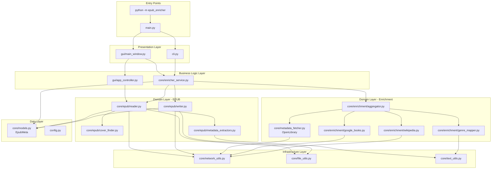
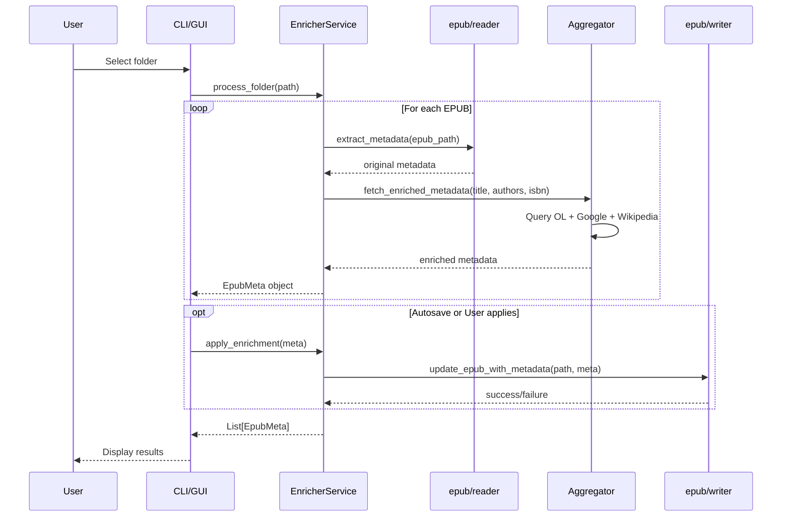
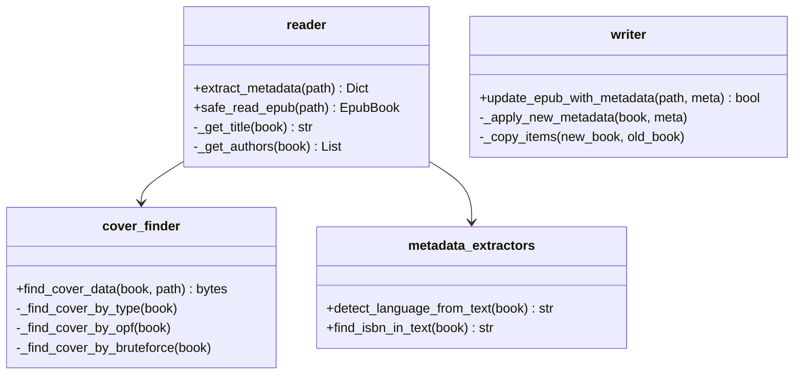
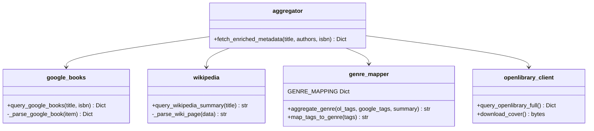
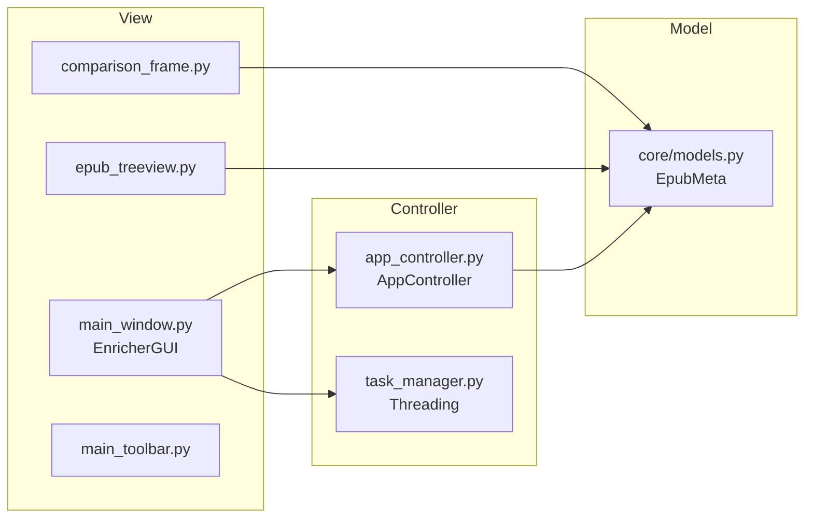

# Architecture du Projet epub_enricher

## Vue d'Ensemble

Le projet `epub_enricher` suit une architecture modulaire basée sur le pattern **MVC (Model-View-Controller)** avec séparation claire entre la logique métier (`core/`), l'interface graphique (`gui/`) et l'interface CLI.

## Diagramme d'Architecture Général



## Flux de Données Principal



## Structure des Modules

### Core - Logique Métier

#### Module `epub/` (Lecture/Écriture EPUB)
- **Responsabilité**: Manipulation des fichiers EPUB
- **Pattern**: Strategy (pour recherche de couverture)



#### Module `enrichment/` (APIs Externes)
- **Responsabilité**: Récupération de métadonnées depuis sources externes
- **Pattern**: Facade + Aggregator



#### Service Layer
- **`EnricherService`**: Orchestrateur du workflow complet
- Utilisé par GUI et CLI (élimine duplication)

```python
class EnricherService:
    def process_epub(self, epub_path: str) -> Optional[EpubMeta]
        # 1. Extract original metadata
        # 2. Fetch suggestions from APIs
        # 3. Aggregate and return EpubMeta
    
    def apply_enrichment(self, meta: EpubMeta) -> bool
        # Apply suggestions to EPUB file
    
    def process_folder(self, folder: str, autosave: bool) -> List[EpubMeta]
        # Process entire folder
```

### GUI - Interface Graphique

#### Architecture MVC



**Séparation des responsabilités**:
- **View**: Composants Tkinter purs, gestion UI
- **Controller**: `AppController` gère l'état, pas de logique UI
- **Model**: `EpubMeta` dataclass, pas de logique métier

### Infrastructure

#### Couche Réseau
- **`network_utils.py`**: Centralise HTTP avec retry pattern

```python
@retry_backoff(max_retries=3, base_delay=1.0)
def http_get(url, **kwargs):
    # Exponential backoff + jitter
    # Gestion timeout, 503, etc.
```

## Patterns Utilisés

### 1. Strategy Pattern (Cover Finder)
Plusieurs stratégies pour trouver la couverture :
1. Par type ITEM_COVER
2. Via métadonnées OPF
3. Brute-force dans les images

### 2. Service Layer Pattern
- `EnricherService` encapsule la logique métier
- Réutilisable par CLI et GUI
- Testable unitairement

### 3. Facade Pattern (Aggregator)
- `fetch_enriched_metadata()` masque la complexité
- Orchestre 3 APIs (OL, Google, Wikipedia)
- Logique d'agrégation centralisée

### 4. Retry Pattern (Network Utils)
- Décorateur `@retry_backoff`
- Stratégie exponential backoff + jitter
- Résilience réseau

### 5. MVC Pattern (GUI)
- Séparation View/Controller/Model
- `AppController` gère l'état
- Threading dans `task_manager`

## Principes SOC/SOR

### ✅ Séparations Respectées

1. **Core/GUI**: `core/` n'a aucune dépendance Tkinter
2. **Lecture/Écriture**: `epub/reader.py` vs `epub/writer.py`
3. **APIs Externes**: Chaque source a son module (`google_books.py`, `wikipedia.py`)
4. **Configuration**: Centralisée dans `config.py`
5. **Réseau**: `network_utils.py` pour toutes les requêtes HTTP

### 📏 Métriques de Conformité

| Module | LOC | Responsabilité | SOC Score |
|--------|-----|----------------|-----------|
| epub/reader.py | 206 | Lecture EPUB | ✅ Excellent |
| epub/writer.py | 241 | Écriture EPUB | ✅ Excellent |
| enrichment/aggregator.py | 113 | Orchestration APIs | ✅ Excellent |
| enrichment/google_books.py | 78 | Client Google Books | ✅ Excellent |
| enricher_service.py | 217 | Service Layer | ✅ Excellent |

## Améliorations Apportées (Refactoring)

### Avant
- `epub_metadata.py`: 355 lignes, 26 fonctions, responsabilités mixtes
- `external_apis.py`: 210 lignes, 3 APIs + mapping dans un seul fichier
- CLI cassé (ImportError)
- 2 tests smoke uniquement

### Après
- **epub/**: 4 modules spécialisés (reader, writer, cover_finder, extractors)
- **enrichment/**: 4 modules spécialisés (google_books, wikipedia, aggregator, mapper)
- **Service Layer**: `EnricherService` élimine duplication GUI/CLI
- **35 tests unitaires** couvrant les modules critiques
- **9 commits atomiques** bien structurés

## Points d'Extension

### Ajouter une Nouvelle Source de Métadonnées

1. Créer `core/enrichment/nouvelle_source.py`
2. Implémenter `query_nouvelle_source(title, isbn) -> Dict`
3. Ajouter l'appel dans `aggregator.fetch_enriched_metadata()`
4. Ajouter tests dans `tests/core/test_enrichment_nouvelle_source.py`

### Ajouter un Nouveau Format de Livre

1. Créer `core/format_xyz/` avec reader.py et writer.py
2. Adapter `EnricherService` pour détecter le format
3. Réutiliser les modules `enrichment/` existants

## Dépendances Principales

- **ebooklib**: Manipulation EPUB
- **requests**: Requêtes HTTP (via network_utils)
- **isbnlib**: Validation/canonization ISBN
- **langdetect**: Détection de langue
- **Pillow**: Traitement d'images (couvertures)
- **tkinter**: Interface graphique

## Configuration

Toutes les constantes dans `config.py`:
- Timeouts réseau
- Chemins répertoires (cache, backups, logs)
- Regex (ISBN)
- Variables d'environnement (`EPUB_ENRICHER_NO_GUI`)

## Logging

- Logger par module: `logger = logging.getLogger(__name__)`
- Rotation des logs activée
- Niveaux appropriés (DEBUG pour dev, INFO pour prod)

---

**Dernière mise à jour**: 2025-11-19 (Refactoring SOC/SOR)
